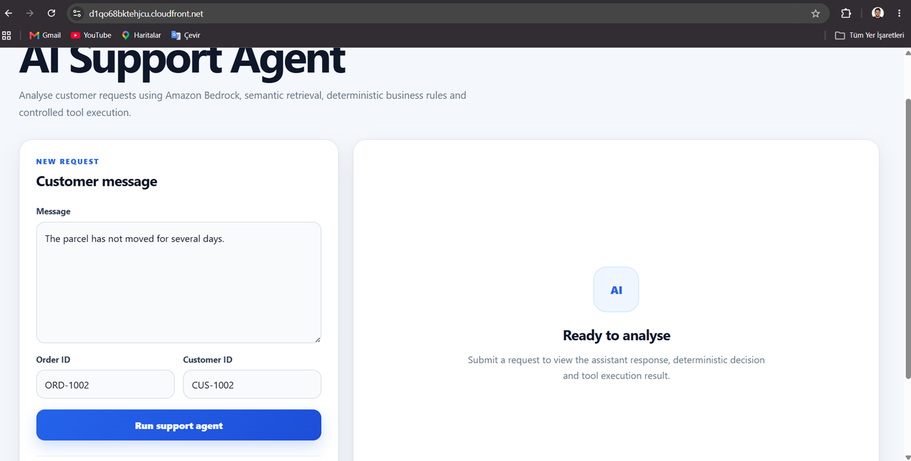
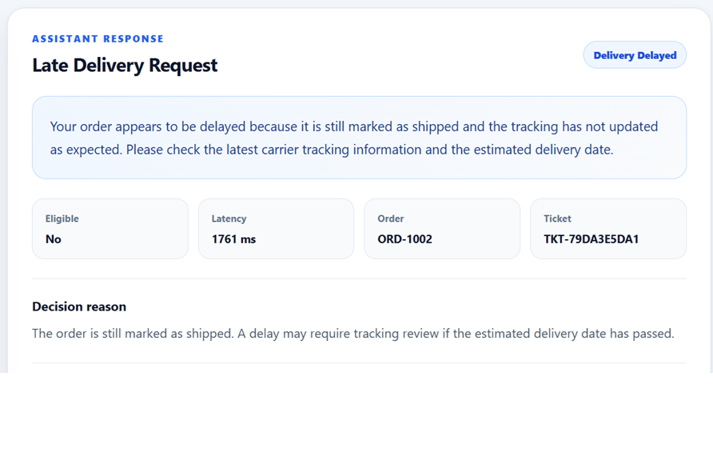
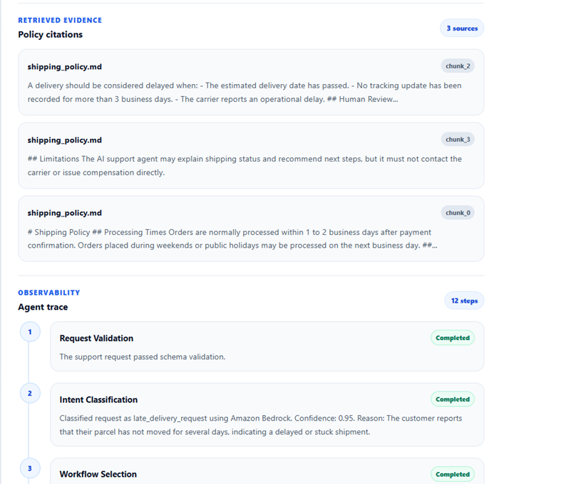

# Enterprise AI Support Agent

A production-style, serverless AI customer support agent built with Amazon Bedrock, FastAPI, React, AWS Lambda, API Gateway, Amazon S3, DynamoDB and CloudFront.

The system combines generative AI with semantic policy retrieval, deterministic business rules, identity validation, controlled tool execution, citations and persistent audit records.

## Live Demo

**Application:**  
https://d1qo68bktehjcu.cloudfront.net

> This deployment is a public portfolio demonstration. Support tickets are generated by a controlled tool layer and stored in Amazon DynamoDB. No real refunds, cancellations, carrier operations or external helpdesk actions are executed.

---

## Application Preview

### Support Agent Interface



### Agent Decision and Controlled Action



### Policy Citations and Execution Trace



---

## Overview

The Enterprise AI Support Agent analyses customer requests and produces structured, policy-grounded support responses.

It demonstrates how large language models can be integrated into an enterprise workflow without allowing the model to make unrestricted business decisions.

The application can:

- Classify customer intent using Amazon Bedrock
- Retrieve relevant company policies using semantic search
- Validate order and customer information
- Apply deterministic business rules
- Generate grounded customer-facing responses
- Route approved decisions to controlled tools
- Create support-ticket records
- Persist request results in Amazon DynamoDB
- Return policy citations
- Return a complete execution trace
- Display the workflow through a React and TypeScript interface

---

## Architecture

```text
User
  │
  ▼
Amazon CloudFront
  │
  ▼
Private Amazon S3 Frontend Bucket
  │
  ▼
React + TypeScript Application
  │
  ▼
Amazon API Gateway HTTP API
  │
  ▼
AWS Lambda Container
  │
  ├── FastAPI
  ├── Request Validation
  ├── Intent Classification
  ├── Order Lookup
  ├── Identity Validation
  ├── Policy Retrieval
  ├── Deterministic Business Rules
  ├── Response Generation
  └── Controlled Tool Routing
          │
          ├── Amazon Bedrock Nova
          ├── Amazon Titan Text Embeddings
          ├── Amazon S3 Policy Documents
          └── Amazon DynamoDB Persistence
```

---

## End-to-End Workflow

```text
Customer request
  │
  ▼
Schema validation
  │
  ▼
Amazon Bedrock intent classification
  │
  ├── Confidence accepted
  │
  └── Deterministic fallback
  │
  ▼
Workflow selection
  │
  ▼
Order lookup
  │
  ▼
Customer identity validation
  │
  ▼
Relevant policy selection
  │
  ▼
Amazon Titan semantic retrieval
  │
  ▼
Deterministic business-rule evaluation
  │
  ▼
Amazon Bedrock response generation
  │
  ▼
Controlled tool routing
  │
  ▼
DynamoDB persistence
  │
  ▼
Structured response with citations and trace
```

---

## Core Design

### 1. Intent Classification

Amazon Bedrock classifies incoming requests into supported workflows.

Current intent categories include:

- `late_delivery_request`
- `shipping_request`
- `refund_request`
- `cancellation_request`
- `damaged_item_request`
- `order_status`
- `general_support`

The classifier returns an intent, confidence score and explanation.

When the confidence score is below the configured threshold, the application uses a deterministic fallback classifier.

This prevents the workflow from depending entirely on a probabilistic model response.

---

### 2. Order and Identity Validation

Before exposing order information or evaluating a customer request, the backend verifies:

- Whether an order ID was supplied
- Whether the order exists
- Whether the customer ID matches the order
- Whether the workflow is supported
- Whether the requested operation requires human review

Order details are not exposed when identity validation fails.

---

### 3. Policy Retrieval

Policy documents are stored independently in Amazon S3.

Current policy documents include:

- `shipping_policy.md`
- `refund_policy.md`
- `cancellation_policy.md`
- `damaged_item_policy.md`
- `escalation_policy.md`

The application selects policy documents based on the classified intent.

Amazon Titan Text Embeddings generates normalized embeddings for:

- The customer request
- Relevant policy chunks

Cosine similarity is then used to rank the policy chunks.

The highest-ranking chunks are included in the response context and returned as citations.

---

### 4. Deterministic Business Rules

The language model does not directly decide whether a refund, cancellation or escalation is allowed.

Final workflow decisions are produced by deterministic validation functions.

Examples include:

- Refund eligibility evaluation
- Cancellation eligibility evaluation
- Late-delivery evaluation
- Damaged-item evaluation
- Shipping-information evaluation
- Customer identity validation

The retrieved policy context is used to explain the decision.

It cannot override the deterministic result.

---

### 5. Grounded Response Generation

Amazon Bedrock generates the final customer-facing response using:

- The original customer message
- The verified order information
- The deterministic decision
- The retrieved policy context

The generated output is validated before being returned.

If Bedrock is unavailable or the output fails validation, a deterministic response provider is used as a fallback.

---

### 6. Controlled Tool Execution

The agent routes approved workflow decisions through a controlled tool layer.

The current implementation supports simulated support-ticket creation.

The tool receives structured arguments including:

- Ticket type
- Request ID
- Customer ID
- Order ID
- Decision reason

A support-ticket reference is generated and stored in DynamoDB.

Example:

```text
TKT-837D86055B
```

The model cannot directly call arbitrary external functions.

Only tools explicitly mapped by the backend can be executed.

---

### 7. DynamoDB Persistence

Each completed request is stored in Amazon DynamoDB.

The stored record includes:

- Request ID
- Creation timestamp
- Intent
- Customer message
- Assistant response
- Order ID
- Customer ID
- Final status
- Decision reason
- Eligibility
- Processing latency
- Tool name
- Tool status
- Tool execution result
- Ticket ID
- Ticket type
- Citation sources
- Execution-trace steps

Example record type:

```text
support_request
```

This creates a persistent audit record for each workflow execution.

---

### 8. Execution Trace

Every response contains a structured trace showing the workflow stages completed by the agent.

Example trace:

```text
request_validation
intent_classification
workflow_selection
order_lookup
identity_validation
policy_scope_selection
policy_retrieval
late_delivery_policy_check
response_generation
tool_routing
tool_execution
decision
```

Each trace step contains:

- Step name
- Status
- Human-readable detail

This makes the agent workflow observable and easier to debug.

---

## Supported Workflows

| Workflow | Example request | Possible result |
|---|---|---|
| Late delivery | “The parcel has not moved for several days.” | Delivery review ticket |
| Shipping information | “When will my order be shipped?” | Verified shipping information |
| Refund request | “I would like a refund.” | Eligibility decision or human review |
| Cancellation request | “Can I cancel my order?” | Cancellation decision |
| Damaged item | “My item arrived damaged.” | Damage review ticket |
| Order status | “What is the current status of my order?” | Verified order status |
| General support | Unsupported or ambiguous request | Human escalation |

---

## Technology Stack

### Frontend

- React
- TypeScript
- Vite
- CSS
- Fetch API
- Amazon S3
- Amazon CloudFront

### Backend

- Python 3.12
- FastAPI
- Pydantic
- Mangum
- Boto3

### AI and Retrieval

- Amazon Bedrock
- Amazon Nova
- Amazon Titan Text Embeddings
- Retrieval-Augmented Generation
- Semantic retrieval
- Cosine similarity
- Source-aware citations
- Deterministic fallbacks

### AWS Infrastructure

- AWS Lambda
- Amazon API Gateway
- Amazon DynamoDB
- Amazon S3
- Amazon CloudFront
- Amazon ECR
- AWS IAM
- AWS CloudFormation
- AWS SAM
- Amazon CloudWatch

### Development and Deployment

- Docker
- Docker Compose
- AWS CLI
- AWS SAM CLI
- Git
- npm

---

## AWS Services

| Service | Responsibility |
|---|---|
| Amazon CloudFront | Public frontend delivery and CDN |
| Amazon S3 | Private frontend assets and policy-document storage |
| API Gateway | Public HTTP API |
| AWS Lambda | Serverless FastAPI backend |
| Amazon Bedrock | Intent classification and response generation |
| Amazon Titan | Semantic policy embeddings |
| DynamoDB | Persistent request and ticket storage |
| Amazon ECR | Lambda container image storage |
| CloudFormation | Infrastructure provisioning |
| AWS SAM | Serverless build and deployment |
| IAM | Restricted service permissions |
| CloudWatch | Lambda logs and operational debugging |

---

## Project Structure

```text
enterprise-ai-support-agent/
├── backend/
│   ├── app/
│   │   ├── agent/
│   │   │   ├── planner.py
│   │   │   ├── tool_router.py
│   │   │   ├── validator.py
│   │   │   └── workflows.py
│   │   ├── core/
│   │   │   └── config.py
│   │   ├── models/
│   │   │   ├── requests.py
│   │   │   ├── responses.py
│   │   │   └── tools.py
│   │   ├── rag/
│   │   │   ├── chunker.py
│   │   │   ├── loader.py
│   │   │   └── semantic_retriever.py
│   │   ├── routers/
│   │   │   ├── policies.py
│   │   │   └── support.py
│   │   ├── services/
│   │   │   ├── bedrock_llm_service.py
│   │   │   ├── llm_service.py
│   │   │   ├── policy_service.py
│   │   │   └── request_store.py
│   │   ├── tools/
│   │   │   ├── order_tool.py
│   │   │   └── ticket_tool.py
│   │   ├── utils/
│   │   ├── lambda_handler.py
│   │   └── main.py
│   ├── data/
│   │   └── policies/
│   ├── evaluation/
│   ├── results/
│   ├── Dockerfile.lambda
│   ├── requirements-lambda.txt
│   └── requirements.txt
├── frontend/
│   ├── public/
│   ├── src/
│   │   ├── components/
│   │   ├── services/
│   │   ├── types/
│   │   └── App.tsx
│   ├── package.json
│   ├── tsconfig.json
│   └── vite.config.ts
├── docs/
│   └── screenshots/
├── template.yaml
├── docker-compose.yml
└── README.md
```

---

## API Endpoint

```http
POST /support/analyse
```

### Example Request

```json
{
  "message": "The parcel has not moved for several days.",
  "order_id": "ORD-1002",
  "customer_id": "CUS-1002"
}
```

### Example Response

```json
{
  "request_id": "req_904554101e71",
  "intent": "late_delivery_request",
  "message": "The parcel has not moved for several days.",
  "assistant_response": "Your order appears to be delayed because it is still marked as shipped and the tracking has not updated as expected. Please check the latest carrier tracking information and the estimated delivery date.",
  "order_id": "ORD-1002",
  "customer_id": "CUS-1002",
  "status": "delivery_delayed",
  "reason": "The order is still marked as shipped. A delay may require tracking review if the estimated delivery date has passed.",
  "eligible": false,
  "latency_ms": 2697.64,
  "tool_result": {
    "tool_name": "create_support_ticket",
    "status": "completed",
    "executed": true,
    "reference_id": "TKT-0FA4E3AC0B",
    "message": "A support ticket was created and stored in DynamoDB."
  },
  "citations": [
    {
      "source": "shipping_policy.md",
      "reference": "chunk_2",
      "excerpt": "A delivery should be considered delayed when the estimated delivery date has passed or no tracking update has been recorded."
    }
  ],
  "trace": [
    {
      "step": "request_validation",
      "status": "completed"
    },
    {
      "step": "intent_classification",
      "status": "completed"
    },
    {
      "step": "policy_retrieval",
      "status": "completed"
    },
    {
      "step": "tool_execution",
      "status": "completed"
    }
  ]
}
```

---

## Local Development

### Prerequisites

- Python 3.12
- Node.js
- npm
- Docker Desktop
- AWS CLI
- AWS SAM CLI
- AWS credentials
- Amazon Bedrock model access

---

## Backend Setup

Navigate to the backend directory:

```bash
cd backend
```

Create a virtual environment:

```bash
python -m venv .venv
```

Activate it on Windows PowerShell:

```powershell
.venv\Scripts\Activate.ps1
```

Install backend dependencies:

```bash
pip install -r requirements.txt
```

Start the FastAPI application:

```bash
uvicorn app.main:app --reload
```

Backend URL:

```text
http://localhost:8000
```

Swagger documentation:

```text
http://localhost:8000/docs
```

Health endpoint:

```text
http://localhost:8000/health
```

---

## Frontend Setup

Navigate to the frontend directory:

```bash
cd frontend
```

Install dependencies:

```bash
npm install
```

Start the development server:

```bash
npm run dev
```

Development frontend:

```text
http://localhost:5173
```

---

## Frontend Environment Configuration

Create:

```text
frontend/.env.production
```

Add:

```env
VITE_API_BASE_URL=https://m6ea3jm4z3.execute-api.eu-west-2.amazonaws.com
```

Build the production frontend:

```bash
npm run build
```

Preview it locally:

```bash
npm run preview
```

Preview URL:

```text
http://localhost:4173
```

---

## Docker Development

Build and start the local services:

```bash
docker compose up --build
```

Expected local services:

```text
Frontend: http://localhost:3000
Backend:  http://localhost:8000
```

Stop the services:

```bash
docker compose down
```

---

## Automated Evaluation

The project includes an automated evaluation suite covering supported workflows and structured agent behaviour.

Latest result:

```text
16 / 16 evaluation cases passed
```

Evaluation areas include:

- Intent classification
- Deterministic fallback behaviour
- Order validation
- Customer identity validation
- Policy scope selection
- Semantic policy retrieval
- Deterministic business decisions
- Tool routing
- Ticket creation
- Citation generation
- Execution-trace generation
- Structured API responses

Run the evaluation suite:

```bash
cd backend
python run_evaluation.py
```

---

## AWS Deployment

### Validate the SAM Template

```bash
sam validate
```

### Build the Lambda Container

```bash
sam build
```

### Deploy the Stack

```bash
sam deploy
```

The stack provisions:

- Lambda container function
- API Gateway HTTP API
- DynamoDB support-request table
- S3 policy-document bucket
- Private S3 frontend bucket
- CloudFront distribution
- Origin Access Control
- IAM permissions
- CloudFormation outputs

---

## Upload Policy Documents

Get the policy bucket name:

```powershell
$policyBucket = aws cloudformation describe-stacks `
  --stack-name enterprise-ai-support-agent `
  --region eu-west-2 `
  --query "Stacks[0].Outputs[?OutputKey=='PolicyBucketName'].OutputValue" `
  --output text
```

Upload policy documents:

```powershell
aws s3 sync `
  backend/data/policies `
  "s3://$policyBucket/policies/" `
  --delete `
  --region eu-west-2
```

List uploaded policies:

```powershell
aws s3 ls `
  "s3://$policyBucket/policies/" `
  --region eu-west-2
```

S3 versioning is enabled for the policy bucket.

Policy documents can therefore be updated without rebuilding the Lambda image.

---

## Deploy the Frontend

Build the production frontend:

```bash
cd frontend
npm run build
cd ..
```

Retrieve the frontend bucket:

```powershell
$frontendBucket = aws cloudformation describe-stacks `
  --stack-name enterprise-ai-support-agent `
  --region eu-west-2 `
  --query "Stacks[0].Outputs[?OutputKey=='FrontendBucketName'].OutputValue" `
  --output text
```

Retrieve the CloudFront distribution ID:

```powershell
$distributionId = aws cloudformation describe-stacks `
  --stack-name enterprise-ai-support-agent `
  --region eu-west-2 `
  --query "Stacks[0].Outputs[?OutputKey=='FrontendDistributionId'].OutputValue" `
  --output text
```

Upload the frontend build:

```powershell
aws s3 sync `
  frontend/dist `
  "s3://$frontendBucket/" `
  --delete `
  --region eu-west-2
```

Invalidate the CloudFront cache:

```powershell
aws cloudfront create-invalidation `
  --distribution-id $distributionId `
  --paths "/*"
```

---

## Infrastructure Outputs

The deployed CloudFormation stack returns:

- Public API URL
- Lambda function name
- DynamoDB table name
- Policy-document bucket name
- Frontend bucket name
- CloudFront distribution ID
- Public CloudFront URL

Current public application URL:

```text
https://d1qo68bktehjcu.cloudfront.net
```

---

## Security and Safety Controls

The project includes:

- Deterministic business decisions
- Confidence-based intent fallback
- Customer identity validation
- Order validation
- Policy-grounded responses
- Restricted IAM permissions
- Private frontend S3 bucket
- S3 public-access blocking
- CloudFront Origin Access Control
- Controlled tool routing
- No direct real-world financial operations
- Persistent DynamoDB audit records
- Structured execution traces
- CORS configuration
- Input schema validation
- Bedrock output validation

---

## Current Limitations

- Authentication is not currently implemented.
- API rate limiting is not currently enabled.
- The public deployment is intended as a portfolio demonstration.
- Support tickets are stored in DynamoDB rather than forwarded to an external helpdesk system.
- Order records are demonstration data.
- The system does not directly contact delivery carriers.
- The system does not issue real refunds.
- The system does not execute real cancellations.
- The system does not issue compensation.
- The deployment currently uses an AWS-generated CloudFront domain.
- Policy embeddings are generated during runtime and cached inside warm Lambda environments.

---

## Future Improvements

- Amazon Cognito authentication
- API Gateway throttling
- AWS WAF protection
- Custom domain
- AWS Certificate Manager integration
- External helpdesk integration
- Admin dashboard
- Policy management interface
- Precomputed policy embeddings
- DynamoDB secondary indexes
- CloudWatch dashboards and alarms
- GitHub Actions CI/CD
- Automated frontend deployment
- Automated policy deployment
- Expanded evaluation datasets
- Cost monitoring and budget alerts

---

## Engineering Highlights

- Designed a complete end-to-end AI application rather than an isolated model demo
- Combined generative AI with deterministic business logic
- Implemented confidence-based model fallbacks
- Added source-aware semantic retrieval
- Deployed FastAPI as a Lambda container
- Managed infrastructure with AWS SAM and CloudFormation
- Stored policies independently in versioned S3 storage
- Persisted workflow results in DynamoDB
- Hosted the frontend through private S3 and CloudFront
- Added execution traces for observability
- Built an automated 16-case evaluation suite
- Implemented controlled tool routing instead of unrestricted model actions

---

## Author

**Orhan Aydın**

- GitHub: https://github.com/orhanaydinn
- Portfolio: Add portfolio URL
- LinkedIn: Add LinkedIn profile URL

---

## License

This project is provided for educational, demonstration and portfolio purposes.